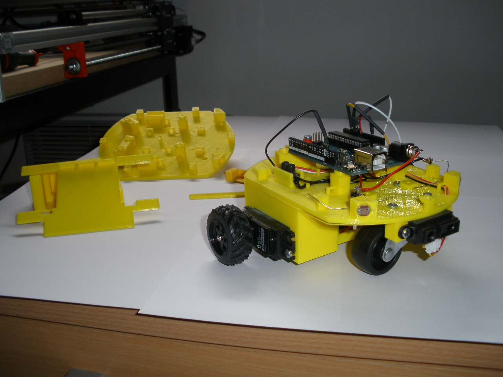

### CocciBot



## Sommaire

- Android

    Contient l'application Android et le projet App Inventor

- Annexes

    Détails pour le choix des servomoteurs, calcul du pont diviseur et tutoriel LCD

- Code Version 1

    Première version du code CocciBot

- Code Version 2

    Seconde version du code CocciBot

- Code Version 3

    Dernière version du code CocciBot    

- Fichiers STL

    Les fichiers 3D du projet

- Images

    Quelques images du robot

- Instructions

    Dossier contenant les instructions du montage et le tutoriel Bluetooth

## Branchements

Voici les branchements du Cocci-Bot pour ce programme :


n° de broche		|		Composant(s)

2			|		Broche RS	(LCD)

3			|		Broche E    	(LCD)

4			|		Broche D4 	(LCD)

5			|		Broche D5 	(LCD)

6			|		Broche D6 	(LCD)

7			|		Broche D7 	(LCD)

8			|		Broche Servomoteur 

9			|		Broche Servomoteur 


Infos : si le robot recule au lieu d'avancer et inversement, il suffit d'échanger les broches servomoteurs


10			|		Broche Rx du module Bluetooth (CRIUS)

12			|		Broche Tx du module Bluetooth (CRIUS)

11			|		Buzzer

14 (A0)		|		Led rouge

15 (A1)		|		Led verte

A2			|		GP2D12 (capteur SHARP)

A5			|		Broche du pont diviseur de tension


## Bluetooth

### Installation de l'application

- Tout d'abord, placez le fichier CREPP.apk dans le dossier "téléchargements"
    	de votre téléphone portable ou de votre tablette avec un fils de connexion USB adapté.

- Allumez votre portable ou tablette et allez dans le dossier où se situe l'application et cliquez dessus : 
	suivez la procédure puis ouvrez l'application


### Modification del'application

- Pour les personnes souhaitant modifier l'application  pour diverses raisons (graphismes qui ne plaisent pas, curiosité...),
	il leur faut tout d'abord se connecter à leur compte App inventor (voir le tutoriel en pièce-jointe, cf. ```Instructions > Tutoriel_CocciBot_Bluetooth```).

- Ensuite,  sélectionnez l'onglet "projects" puis "import project (.aia) from my computer"	

- Sélectionnez  le fichier "CREPP.aia" du dossier comportant le tutoriel

- L'interface graphique de l'application devrait s'ouvrir.
	A vous de la modifier (aide avec le tutoriel) !! 


## Matériel

- 1 structure en ABS pou PLA comprenant 6 éléments

- 2 servomoteurs à RC avec roues
- 1 roulette AV

- 1 capteur de distance
- 1 afficheur LCD
- 2 photorésistances

- 1 coupleur de 6 piles LR
- 1 coupleur 9v en I

- 1 fiche din alimentation
- 1 interrupteur
- 5 connecteurs à souder
- 2 dominos

- Visserie M3


